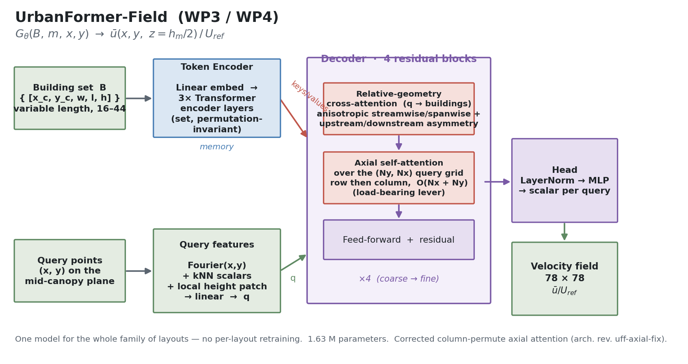
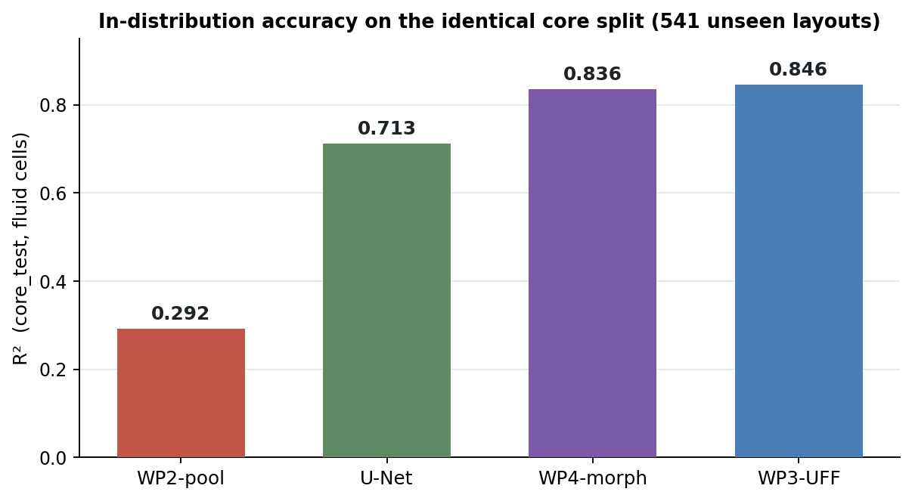
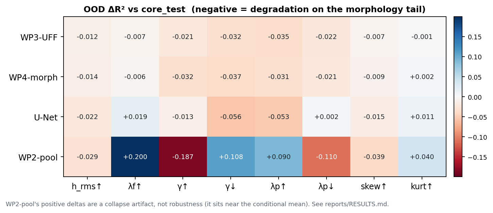

# UrbanFormer

A geometry-conditioned Transformer surrogate for urban canopy flow, built and ablated across six work packages on 5,225 lattice-Boltzmann cases.

**In one sentence:** given the footprints and heights of the buildings on a city block, predict the mean wind speed at every point of the pedestrian-level plane, for any layout in the family, without running a fluid solver per layout.

The model maps a **set of buildings** to a **continuous velocity field**, not one grid to another grid:

```
G_theta(B, m, x, y)  ->  u_bar(x, y, z = h_m / 2) / u_ref
```

`B` is a variable-length set of building tokens `[x_c, y_c, w, l, h]`, `m` is an 8-dimensional global morphology vector, `(x, y)` is an arbitrary query point on the mid-canopy plane. One model covers the whole family of urban layouts. No per-layout retraining.



The permutation-invariant set encoder turns the buildings into memory; each decoder block gives every query point the right buildings (relative-geometry cross-attention) and then makes neighbouring queries cohere (axial self-attention over the grid). Regenerate this figure with `python scripts/make_arch_figure.py`.

---

## Results

All four models retrained from scratch on the identical core split (`core_train` = 2,518 layouts), so every delta is attributable to architecture, not to training-set exposure. `core_test` (541 unseen layouts) is the in-distribution control. Metrics over fluid cells only.

| Model | Representation | RMSE | MAE | R² | rel-L2 | Spearman |
|---|---|---:|---:|---:|---:|---:|
| U-Net (WP1) | raster height map | 0.8457 | 0.4900 | 0.7129 | 0.4853 | 0.8755 |
| WP2-pool | pooled tokens + Fourier/FiLM | 1.3280 | 0.8819 | 0.2921 | 0.7620 | 0.5804 |
| **WP3-UFF** | **tokens + cross-attn + axial** | **0.6192** | **0.3722** | **0.8461** | **0.3553** | **0.9483** |
| WP4-morph | WP3 + global morphology token | 0.6397 | 0.3895 | 0.8358 | 0.3671 | 0.9451 |

UrbanFormer-Field is 1.63M parameters.



Out-of-distribution, across eight morphology tail regimes at the 95th percentile:

| Model | core R² | mean OOD R² | robustness gap | worst regime | worst R² |
|---|---:|---:|---:|---|---:|
| WP3-UFF | 0.8461 | 0.8288 | 0.0173 | λp↑ | 0.8110 |
| WP4-morph | 0.8358 | 0.8173 | 0.0185 | γ↓ | 0.7991 |
| U-Net | 0.7129 | 0.6972 | 0.0158 | γ↓ | 0.6568 |
| WP2-pool | 0.2921 | 0.3014 | -0.0092 | γ↑ | 0.1053 |



Per-regime ΔR², physics-oriented error metrics (wake RMSE, canyon RMSE, velocity-deficit RMSE, low/high-speed area errors), and the full per-WP write-up: [reports/RESULTS.md](reports/RESULTS.md).

### Four findings

**Pooling is the bottleneck, not the decoder.** The pooled Transformer collapsed toward a near-mean field (R² ≈ 0.06). Random Fourier query features plus FiLM conditioning recovered 0.06 → 0.44, which proves the decoder's spectral bias was *a* bottleneck. It never reached the U-Net. One pooled vector cannot carry per-location geometry. That is what made per-query cross-attention mandatory in WP3 rather than more decoder engineering.

**Object-based beats raster in-distribution.** UF-F reaches R² 0.846 against the U-Net's 0.713. The working hypothesis going in was that the rasterized CNN would keep an in-distribution advantage. It is falsified.

**The global morphology vector is redundant (null result).** WP4's decision rule was fixed before the run: `token` must beat `none`, *and* the gain must die under a shuffle control that rolls `m` across the batch. `token` = 0.8358 against `none` = 0.8461. The first condition failed, so the shuffle control never came into play. The building tokens already encode everything `m` summarizes, which is unsurprising in hindsight: `lambda_p`, `lambda_f`, `h_m`, `h_rms`, the height moments and `gamma_m` are all computable from the tokens the encoder already sees.

**OOD failure is data-driven, not architecture-driven.** UF-F and the U-Net degrade by nearly the same amount on the morphology tails (0.0185 vs 0.0158). High alignedness (`γ↑`, long open streamwise canyons) is the one regime hard for every model, including the raster CNN. That is a property of the training distribution, not of the representation.

---

## A bug that changed the story

`AxialSelfAttention`'s column branch reshaped `(B, Ny, Nx, D)` straight to `(B*Nx, Ny, D)` without first permuting to `(B, Nx, Ny, D)`. Each "column" sequence was in fact a row, and its attention output was written back into a column through the transposed view. The model attended over rows twice and scattered the second result transposed. There was no column attention at all.

`reshape` never raised, because `B*Ny*Nx*D` factors identically either way, on any grid, square or not. No shape check catches it. The two variants differ in no config key and no tensor shape, so no provenance guard catches it either.

- Every UF-F number before the fix, including the original headline R² = 0.8284 that beat the U-Net, came from a model with streamwise coupling only. **The result stands. The mechanism attributed to it does not.**
- Weights do not transfer, so WP3 is a retrain, not a reload.
- WP3 and WP4 previously differed in two levers, the morphology token *and* axial correctness. WP4's apparent `+0.386 ΔR²` was that confound. They now differ in exactly one lever, which is what WP-isolation requires.

The regression test is [`tests/test_axial.py`](tests/test_axial.py). Two of its ten assertions catch the bug. The other eight pass on the buggy code, including a gather-roundtrip identity check, because the forward and inverse were wrong symmetrically. Ordering, not shape, is the only thing separating the two variants. WP5 additionally enforces a checkpoint provenance guard (`WP`, `SPLIT`, `N_TRAIN`, `MORPH_MODE`, `ARCH_REV`) so a stale checkpoint cannot silently occupy a row in the comparison table. The guard exists because of this bug.

---

## Quickstart

```bash
git clone https://github.com/remi1015/urbanformer.git && cd urbanformer
python -m venv .venv && source .venv/bin/activate
pip install -e ".[dev]"
pytest -q                               # 68 passing, no data or GPU required

# data is not in git
pip install kaggle                      # token at ~/.kaggle/kaggle.json
python scripts/fetch_data.py --all
jupyter lab notebooks/00_build_dataset.ipynb
```

The full suite is 68 tests and runs on CPU with no dataset present: every module (losses, metrics, data contracts, all four models, the provenance guard, and the `uff-axial-fix` regression) is covered on synthetic inputs. `tests/test_axial.py` is where the bug story is pinned.

## Layout

```
urbanformer/           importable package, single source of truth
  data.py              datasets, collate, split loading
  morphology.py        building extraction, alignedness descriptors
  losses.py            masked MSE, gradient loss, spectral loss
  metrics.py           field metrics, physics metrics, per-case metrics
  provenance.py        WP5 checkpoint guard
  models/
    unet.py            WP1 raster baseline
    pooled.py          WP2 pooled encoder, FiLM decoder
    axial.py           axial self-attention over the query grid
    field.py           UrbanFormer-Field (WP3/WP4)
notebooks/             00..05, one per work package, thin drivers over the package
tests/                 pytest, 68 tests, run on synthetic data (no dataset needed)
reports/RESULTS.md     every number, per work package
reports/PORTING_NOTES.md  how the notebooks were ported into the tested package
docs/figures/          architecture.png (committed); qualitative galleries, spectral/
                       range diagnostics and the OOD heatmap regenerate via make_figures.py
splits/                core_{train,val,test}_cases.txt, pulled by fetch_data.py --splits
scripts/fetch_data.py       pulls raw data, splits, checkpoints from Kaggle
scripts/make_arch_figure.py generates docs/figures/architecture.png (data-free)
scripts/make_figures.py     regenerates the data-dependent figures (needs data + checkpoints)
```

## Data

5,225 LBM cases, doubly periodic domain, 78×78 mid-plane grid, 16 to 44 buildings per case (mean 28). Target is `u_bar / u_tau` on the plane `z = h_m / 2`; loss and metrics are masked to fluid cells (`geom != 8`). Splits are by full urban layout, so no grid-point leakage.

Nothing under `data/` is tracked. See [reports/RESULTS.md](reports/RESULTS.md) for the descriptor distributions and the split sizes.

## Known limitations

- Single plane, single Reynolds regime, single wind direction. The operator generalizes over layout, not over flow condition.
- The `query` and `token+shuffle` arms of the WP4 matrix are specified but not yet logged. The null result rests on `token` vs `none` alone.
- `high_h_max` was dropped as an OOD regime: the `h_max` column is quantized enough to make the 95th-percentile tail degenerate. Replaced by `high_lambda_f`.
- Axial factorized attention is a compromise. It is O(Nx + Ny) per query instead of O(Nx·Ny), which is what makes joint grid decoding affordable, but it cannot represent diagonal interactions in a single layer.

## References

Lu, Y. et al. (2023), alignedness descriptors for urban canopy flow.
Vaswani, A. et al. (2017), Attention Is All You Need.
Perez, E. et al. (2018), FiLM: Visual Reasoning with a General Conditioning Layer.
Tancik, M. et al. (2020), Fourier Features Let Networks Learn High Frequency Functions.

## License

MIT. See [LICENSE](LICENSE).
