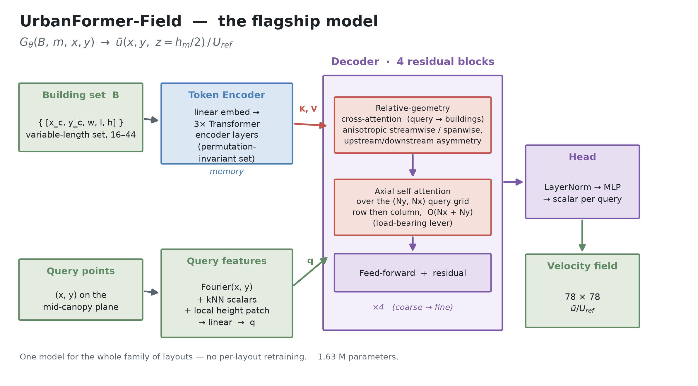
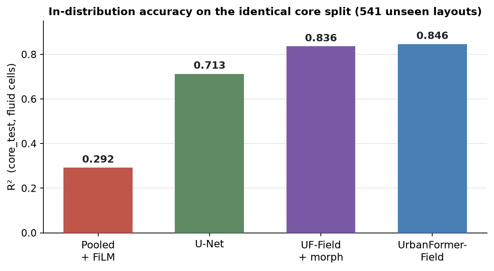
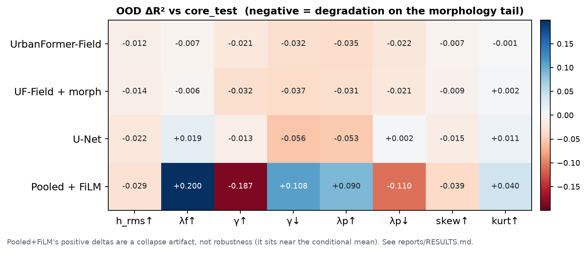

# UrbanFormer

A geometry-conditioned Transformer **surrogate** for urban canopy flow: it
replaces an expensive fluid solver with a fast neural network. Given the
buildings on a city block, it predicts the mean wind speed at every point of a
horizontal plane between the buildings — for any layout in the family, without
running a new simulation.

Built and ablated across six "work packages" (WP0–WP5) on **5,225
Lattice-Boltzmann simulations**.

> **New here and coming from ML, not fluids?** Read
> [the ML framing](#the-problem-in-ml-terms) below, then keep
> [`docs/glossary.md`](docs/glossary.md) open — it translates every
> fluid-mechanics term (canopy, friction velocity, λp, wake, canyon, …) into
> plain language and its ML role.

---

## The problem, in ML terms

**Task type.** Supervised *surrogate modeling* (a.k.a. emulation): learn a fast
approximation of a slow, deterministic simulator. The training targets are
fields extracted from CFD; the network does not redefine any physics, it only
approximates the simulator's output.

**The map it learns.** UrbanFormer maps a **variable-length set** of buildings to
a **continuous 2-D scalar field**, and evaluates that field at arbitrary query
coordinates:

```
G_theta( B, m, x, y )  ->  u_bar(x, y, z = h_m / 2) / u_ref
```

- `B` — a set of building tokens, each a 5-vector `[x_c, y_c, w, l, h]`
  (centre, footprint width/length, height). **Order-invariant**: buildings are a
  *set*, not a sequence. 16–44 buildings per block.
- `m` — an 8-dim global "morphology" vector of hand-engineered geometry
  statistics (densities, height moments, street alignedness). See
  [glossary](docs/glossary.md#7-morphology-descriptors).
- `(x, y)` — a query point on the horizontal mid-canopy plane. The decoder is
  **coordinate-based**, so you can query any point, at any resolution.
- Output — a scalar: the normalized time-averaged streamwise wind speed at that
  point.

This is **not** a fixed grid-to-grid image translation. It is closer to a
**conditional neural field / operator-learning** setup: a permutation-invariant
*set encoder* produces memory, and a *coordinate decoder* reads that memory to
render the field. One trained model covers the whole family of layouts — **no
per-layout retraining.**

**ML anchors for the architecture** (details in
[`docs/glossary.md`](docs/glossary.md#9-ml-building-blocks-used-here)):

| Component | Does what | Closest familiar idea |
|---|---|---|
| Token set encoder | building set → memory, order-invariant | Deep Sets / Set Transformer |
| Query→building cross-attention | condition each output point on the geometry | Perceiver IO decoder |
| Coordinate + Fourier features | feed `(x, y)` to an MLP without spectral bias | NeRF / SIREN, Fourier features |
| Axial self-attention on the grid | make neighbouring output points cohere | Axial Transformer / MaxViT |
| FiLM (WP2 only) | modulate a decoder with a global vector | FiLM conditioning |
| Masked MSE (+ grad + spectral) | score only fluid cells, penalize blur | standard, with structural terms |

### Input / output tensor contract (the flagship, UrbanFormer-Field)

What a `DataLoader` batch of `B` city blocks looks like (`N` = padded building
count, `Q = Ny·Nx = 78·78` query points; see `urbanformer/data.py`):

| tensor | shape | dtype | meaning |
|---|---|---|---|
| `tokens` | `(B, N, 5)` | float32 | building set, features in `[0, 1]` |
| `padding_mask` | `(B, N)` | bool | `True` = padding slot (set sizes differ) |
| `query_xy` | `(B, Q, 2)` | float32 | normalized cell-centre coordinates |
| `qfeats` | `(B, Q, 4)` | float32 | per-query scalars `[h_local, d_near, h_near, d_up]` |
| `patches` | `(B, Q, 81)` | float32 | local 9×9 height window per query |
| `target` | `(B, Ny, Nx)` | float32 | `u_bar / u_ref` on the plane |
| `fluid` | `(B, Ny, Nx)` | float32 | `1` = fluid cell, `0` = building; the loss mask |

`model(tokens, padding_mask, query_xy, qfeats, patches, Ny, Nx)` returns
`(B, Q)`, reshaped to `(B, Ny, Nx)`. The U-Net baseline (WP1) instead consumes a
4-channel raster `(B, 4, Ny, Nx)` — that is the point of the comparison:
**object-set vs raster image.**

---

## The problem, in fluid-mechanics terms (30-second version for ML readers)

Wind blows over a block of buildings. Inside the "urban canopy" (the air layer
between the buildings, up to roof height) the flow is slow, recirculating, and
strongly shaped by the building layout — this is what sets pedestrian comfort and
pollution ventilation. Resolving it normally means a CFD run per layout. We take
a fixed horizontal slice at mid-building-height, `z = h_m / 2`, and predict the
time-averaged along-wind speed there, normalized by a reference velocity. Every
term in that sentence is defined in [`docs/glossary.md`](docs/glossary.md).



The permutation-invariant set encoder turns the buildings into memory; each
decoder block gives every query point the right buildings (relative-geometry
cross-attention) and then makes neighbouring queries cohere (axial self-attention
over the grid). Regenerate this figure with `python scripts/make_arch_figure.py`.

---

## Results

All four models were retrained from scratch on the identical core split
(`core_train` = 2,518 layouts), so every delta is attributable to architecture,
not to training-set exposure. `core_test` (541 unseen layouts) is the
in-distribution control. Metrics are over fluid cells only. (`R²`, `rel-L2`, and
Spearman rank-correlation carry their usual meaning; here they are pooled over
all fluid grid points of the test set.)

| Model | Representation | RMSE | MAE | R² | rel-L2 | Spearman |
|---|---|---:|---:|---:|---:|---:|
| U-Net (WP1) | raster height map | 0.8457 | 0.4900 | 0.7129 | 0.4853 | 0.8755 |
| WP2-pool | pooled tokens + Fourier/FiLM | 1.3280 | 0.8819 | 0.2921 | 0.7620 | 0.5804 |
| **WP3-UFF** | **tokens + cross-attn + axial** | **0.6192** | **0.3722** | **0.8461** | **0.3553** | **0.9483** |
| WP4-morph | WP3 + global morphology token | 0.6397 | 0.3895 | 0.8358 | 0.3671 | 0.9451 |

UrbanFormer-Field is 1.63M parameters.



Out-of-distribution, across eight morphology tail regimes at the 95th percentile:

| Model | core R² | mean OOD R² | robustness gap | worst regime | worst R² |
|---|---:|---:|---:|---|---:|
| WP3-UFF | 0.8461 | 0.8288 | 0.0173 | λp↑ | 0.8110 |
| WP4-morph | 0.8358 | 0.8173 | 0.0185 | γ↓ | 0.7991 |
| U-Net | 0.7129 | 0.6972 | 0.0158 | γ↓ | 0.6568 |
| WP2-pool | 0.2921 | 0.3014 | -0.0092 | γ↑ | 0.1053 |



Per-regime ΔR², physics-oriented error metrics (wake RMSE, canyon RMSE,
velocity-deficit RMSE, low/high-speed area errors), and the full per-WP write-up:
[reports/RESULTS.md](reports/RESULTS.md).

### Four findings

**Pooling is the bottleneck, not the decoder.** The pooled Transformer collapsed
toward a near-mean field (R² ≈ 0.06). Random Fourier query features plus FiLM
conditioning recovered 0.06 → 0.44, which proves the decoder's spectral bias was
*a* bottleneck. It never reached the U-Net. One pooled vector cannot carry
per-location geometry. That is what made per-query cross-attention mandatory in
WP3 rather than more decoder engineering.

**Object-based beats raster in-distribution.** UF-F reaches R² 0.846 against the
U-Net's 0.713. The working hypothesis going in was that the rasterized CNN would
keep an in-distribution advantage. It is falsified.

**The global morphology vector is redundant (null result).** WP4's decision rule
was fixed before the run: `token` must beat `none`, *and* the gain must die under
a shuffle control that rolls `m` across the batch. `token` = 0.8358 against
`none` = 0.8461. The first condition failed, so the shuffle control never came
into play. The building tokens already encode everything `m` summarizes, which is
unsurprising in hindsight: `lambda_p`, `lambda_f`, `h_m`, `h_rms`, the height
moments and `gamma_m` are all computable from the tokens the encoder already sees.

**OOD failure is data-driven, not architecture-driven.** UF-F and the U-Net
degrade by nearly the same amount on the morphology tails (0.0185 vs 0.0158).
High alignedness (`γ↑`, long open streamwise canyons) is the one regime hard for
every model, including the raster CNN. That is a property of the training
distribution, not of the representation.

---

## A bug that changed the story

`AxialSelfAttention`'s column branch reshaped `(B, Ny, Nx, D)` straight to
`(B*Nx, Ny, D)` without first permuting to `(B, Nx, Ny, D)`. Each "column"
sequence was in fact a row, and its attention output was written back into a
column through the transposed view. The model attended over rows twice and
scattered the second result transposed. There was no column attention at all.

`reshape` never raised, because `B*Ny*Nx*D` factors identically either way, on
any grid, square or not. No shape check catches it. The two variants differ in no
config key and no tensor shape, so no provenance guard catches it either.

- Every UF-F number before the fix, including the original headline R² = 0.8284
  that beat the U-Net, came from a model with streamwise coupling only. **The
  result stands. The mechanism attributed to it does not.**
- Weights do not transfer, so WP3 is a retrain, not a reload.
- WP3 and WP4 previously differed in two levers, the morphology token *and* axial
  correctness. WP4's apparent `+0.386 ΔR²` was that confound. They now differ in
  exactly one lever, which is what WP-isolation requires.

The regression test is [`tests/test_axial.py`](tests/test_axial.py). Two of its
ten assertions catch the bug. The other eight pass on the buggy code, including a
gather-roundtrip identity check, because the forward and inverse were wrong
symmetrically. Ordering, not shape, is the only thing separating the two
variants. WP5 additionally enforces a checkpoint provenance guard (`WP`, `SPLIT`,
`N_TRAIN`, `MORPH_MODE`, `ARCH_REV`) so a stale checkpoint cannot silently occupy
a row in the comparison table. The guard exists because of this bug.

---

## Quickstart

```bash
git clone https://github.com/remi1015/urbanformer.git && cd urbanformer
python -m venv .venv && source .venv/bin/activate
pip install -e ".[dev]"
pytest -q                               # 80 passing, no data or GPU required

# The CLI drives the same package the notebooks use. No dataset needed to smoke it:
python -m urbanformer.train --wp 3 --smoke      # one forward+backward for UF-F
python -m urbanformer.eval  --wp 5              # reports what data it needs, then exits
#   (installed as console scripts too: `urbanformer-train` / `urbanformer-eval`)
```

Getting the data and running a full training/eval pass:

```bash
pip install kaggle                      # token at ~/.kaggle/kaggle.json
python scripts/fetch_data.py --all      # raw LBM data, splits, four core checkpoints
jupyter lab notebooks/00_build_dataset.ipynb
```

The full suite is **80 tests** and runs on CPU with no dataset present: every
module (losses, metrics, data contracts, all four models, the CLI/train step, the
provenance guard, and the `uff-axial-fix` regression) is covered on synthetic
inputs. `tests/test_axial.py` is where the bug story is pinned.

---

## Layout

```
urbanformer/           the importable package — single source of truth
  __init__.py          package docstring, __version__, curated public API
  config.py            per-WP config registry + model factory
  train.py             `python -m urbanformer.train` (CLI + data-free smoke step)
  eval.py              `python -m urbanformer.eval`  (CLI + pure grid/table helpers)
  data.py              datasets, collate, split loading, query featurization
  morphology.py        building extraction, alignedness descriptors
  losses.py            masked MSE, gradient loss, spectral loss
  metrics.py           field metrics, physics metrics, per-case metrics
  provenance.py        WP5 checkpoint guard
  models/
    unet.py            WP1 raster baseline
    pooled.py          WP2 pooled encoder, FiLM decoder
    axial.py           axial self-attention over the query grid
    field.py           UrbanFormer-Field (WP3/WP4)
notebooks/             00..05, one per work package, thin drivers over the package
tests/                 pytest, 80 tests, run on synthetic data (no dataset needed)
docs/glossary.md       fluid-mechanics ↔ ML dictionary (start here if new to CFD)
docs/figures/          architecture.png (committed); the data-dependent figures
                       regenerate via scripts/make_figures.py
reports/RESULTS.md     every number, per work package
reports/PORTING_NOTES.md  how the notebooks were ported into the tested package
splits/                core_{train,val,test}_cases.txt, pulled by fetch_data.py --splits
scripts/fetch_data.py       pulls raw data, splits, checkpoints from Kaggle
scripts/make_arch_figure.py generates docs/figures/architecture.png (data-free)
scripts/make_figures.py     regenerates the data-dependent figures (needs data + checkpoints)
```

The **notebooks** (`00`–`05`) are the exploratory, per-work-package narrative.
The **package** is the tested, importable distillation of that narrative — the
notebooks and the CLI both import it, so there is exactly one implementation of
every function. See [reports/PORTING_NOTES.md](reports/PORTING_NOTES.md) for how
each function was extracted and validated against its notebook source.

## Data

5,225 LBM cases, doubly periodic domain, 78×78 mid-plane grid, 16 to 44 buildings
per case (mean 28). Target is `u_bar / u_tau` on the plane `z = h_m / 2`; loss and
metrics are masked to fluid cells (`geom != 8`). Splits are by full urban layout,
so no grid-point leakage between train and test.

Nothing under `data/` is tracked in git. See
[reports/RESULTS.md](reports/RESULTS.md) for the descriptor distributions and the
split sizes, and [`docs/glossary.md`](docs/glossary.md) for what `u_tau`,
`geom`, and "doubly periodic" mean.

## Known limitations

- Single plane, single Reynolds regime, single wind direction. The operator
  generalizes over layout, not over flow condition.
- The `query` and `token+shuffle` arms of the WP4 matrix are specified but not
  yet logged. The null result rests on `token` vs `none` alone.
- `high_h_max` was dropped as an OOD regime: the `h_max` column is quantized
  enough to make the 95th-percentile tail degenerate. Replaced by `high_lambda_f`.
- Axial factorized attention is a compromise. It is O(Nx + Ny) per query instead
  of O(Nx·Ny), which is what makes joint grid decoding affordable, but it cannot
  represent diagonal interactions in a single layer.

## References

**Domain.** Lu, Y. et al. (2023), alignedness descriptors for urban canopy flow.

**Architecture.** Vaswani, A. et al. (2017), *Attention Is All You Need*;
Zaheer, M. et al. (2017), *Deep Sets*; Lee, J. et al. (2019), *Set Transformer*;
Jaegle, A. et al. (2021), *Perceiver IO*; Ho, J. et al. (2019),
*Axial Attention*; Tancik, M. et al. (2020),
*Fourier Features Let Networks Learn High Frequency Functions*; Perez, E. et al.
(2018), *FiLM: Visual Reasoning with a General Conditioning Layer*.

## License

MIT. See [LICENSE](LICENSE).
